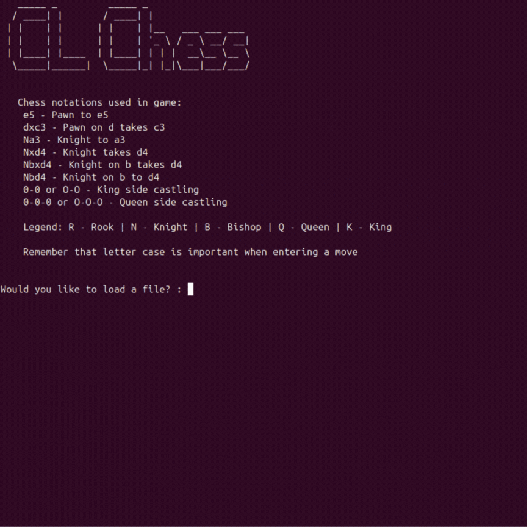

# Ruby Command Line Chess
## A fully functional command line chess project that follows all the movement rules in chess.
This program applies every movement constraints in chess including: 
- En passant
- Castling
- Limiting valid moves during a check
- Limiting valid moves that will result in a check

## Features
- - - 
- Saving current game state to a filename input by user
- Uses chess notations as input for movement
- Rejects invalid movements
- Checks end game conditions (Stalemate, Checkmate, Draw)
- Detects whether a move will result in check
- 3 modes
	- Human Vs Human
	- Human Vs Computer
	- Computer Vs Computer

## Demonstration
- - - 

- - -
This is the final project for the Odin Project Ruby Section along the Ruby Path. The aim is to practice and implement all previous topics discussed in this section including: 
- Object Oriented Programming
- Data structures and algorithms
- Serialization
- Git
- Test Driven Development (using RSPEC)
- Linting and RuboCop
- Debugging

